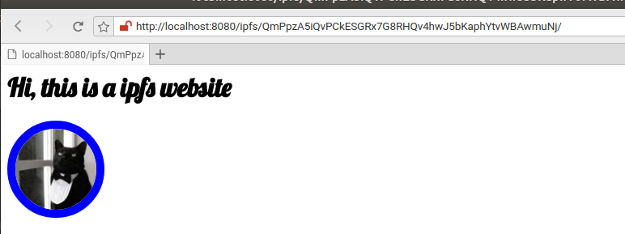

# I P F S 


*img source wikipedia.org*

## Introduction to IPFS

InterPlanetary File System (IPFS) is - 
* Open source project :heavy_check_mark: 
* Protocol :heavy_check_mark: 
* Network :heavy_check_mark:
* Peer-to-peer distributed file system :heavy_check_mark:
* Modular :heavy_check_mark:
* encrypted :heavy_check_mark:

and so on !! 

Take a deep dive [here](https://github.com/ipfs/ipfs) !! 

In short, it is Git like version control system which works like BitTorrent and provides security like bitcoin !!!! Wow !!! 
There is more though, it can work as web and even has its own name service called IPNS .... 

## Why would we use it ?

To make web faster, safer and more open. but how ? 

Look at this [Stanford Seminar - IPFS and the Permanent Web](https://www.youtube.com/watch?v=HUVmypx9HGI)

Or just look here - 
*img source ipfs.io*

* Centralized 
   - One place stores everything and everyone access the files from this place ! 
   - (Imagine One StarBucks :coffee: in town and Everyone wants :coffee: !)
   - I won't get coffee soon :(
* Decentralized 
   - One place stores everything and everyone access the files from this place ! 
   - (Imagine Main StarBucks :coffee: in town and Everyone wants :coffee: !)  
   - I will get coffee in sometime :|
* Distributed
   - One place stores everything and everyone access the files from this place ! 
   - (Imagine Everyone can sell StarBucks :coffee: and Everyone wants :coffee: !)
   - I will get coffee right away :D
   
### Okay !! I think you can figure out things now and will proceed to some hands on -- 

# Installation 
* Download [ipfs](https://dist.ipfs.io/#go-ipfs) for desired os
> For unix based os 
```shell
tar xvfz go-ipfs.tar.gz && cd go-ipfs && ./install.sh
```
> For windows `unzip and run ipfs.exe`
    
* `ipfs help` will list all cmds and subcommands with direction to use, at this point I assume you all are familiar with command line utilities like git or any other.

### Okay , lets dive into ipfs world ! 

#### setup the repo
> create a folder for name ipfs 
    navigate to that folder
        and initialize a repository ! 

```bash
mkdir ipfs && cd ipfs && ipfs init
```


> ipfs init will initialize the repository similar to `git init`. This generates an RSA keypair and peer identity hash ! files with this peer can be seen using cat cmd

```bash
ipfs cat ipfs/hash/name
```


Now we will create a file and add it to our ipfs repository 

```bash
echo 'Hello ipfs world !' >> hello.txt
```


After adding this file to ipfs we can see that it generates a hash to address file, and the content can be seen using this file hash.

If change this file and add it again, we will have two versions of the same files with different hash.

```bash
echo 'Hello again !' >> hello.txt
```
you can see now we have two different version with different hash identity.


> This how ipfs provides verions of same file over time and we can keep track when the files have 
been changed.
 
I will leave it upto you to explore ipfs ls and refs cmds which shows the file list and references and move on to the swarm part !! 

We have added the files to ipfs repo which is local and ready to become a peer in ipfs network.

ipfs has a garbage collector, which removes files after 24 hours. So to keep it permanently within your repository you have to pin it !

All the pinned files can be seen using `ipfs pin ls`


#### lets connect to ipfs network

`ipfs daemon` cmd will start ipfs server in your machine

```bash
ipfs daemon
```
* you can start it with logging mode `env ipfslogs=info ipfs daemon`


Now when my ipfs is up I can see my online via  public IPFS gateways - 
 > address would be something like https://ipfs.io/ipfs/QmSiVMsAKohCby7HMENZkoPo4xy46U6AeovT9oR2q13tHE where hash part will be the content hash


As you can see above it will start a server utilizing your current network addresses. Now see other peers in the network by running - 

```bash
ipfs swarm peers
```


Now when your connected to ipfs network how you see it ? Well ipfs has a simple webgui which will show you all the connected nodes ! Yay!! 

visit http://localhost:5001/webui/ in your browser


 
 
 # Use case - Secure file sharing using IPFS and Public private keys

 * Setup GPG on other machine or any virtual machine as below -
 
 I will create a new set of keys using below commands
 ```bash 
 gpg --gen-key
 ```
 This after running this command you will be asked your name and email address, as soon as you enter and confirm the keys will be created for you. I created them with some dummy values.
  

Now export your public keys 
 ```bash 
 gpg --export --armor -email > namepubkey.asc
 ```
  

Pretend this public key is someone else's key and import them in your first machine where you will encrypt file and add to ipfs. 
```bash
gpg --import namepubkey.asc
gpg --list-keys
```

 * Setup IPFS (if you didn't while reading above sections)
 I already did!!

 * Identify a file to be shared securely !!! Or just create one `echo "SuperSecureText" >> securefile.txt`
  
  


 * Encrypt the file with someone else's public key

  

 * add to ipfs repository and capture hash

   

   you can also pin the file using `ipfs pin add filehash` (replace filehash with actual hash)

 * start `ipfs daemon` and share the hash with the audience
 * They will be able to see it via ipfs public gateway 
  Like my file is accessible using this link - https://ipfs.io/ipfs/QmeE3Q5KbqgxK6kebaC927jfgKvUB8xY55pbYmNLiL8UxW

  or you can download using `ipfs get hash` (replace hash with actual hash of encrypted file)
  
  * Download the file and decrypt it with you private keys 

    

 * person with correct key can decrypt and see content

We explored one use case that how we can use ipfs to share encrypted files.

---
 
# ipfs for websites (using ipns)

Similar to github, you can also host you website using ipfs !!! cool, isn't it ?

## how to host website ?

Well, you can to create and directory and place all the files in website as you would normally do for uploading a website on server. I will create a folder called mysite and put some files on it.

* I will put an index.html with some text, a css file and a image file inside mysite directory. 

    
        

* I will add the folder and files recursively to ipfs.

    

At the end of logs, you can see that mysite root hash is also generated. 

* using the `mysite` root hash we can see our site content on local/public ipfs gateway. (`ipfs daemon` must be running) 

    
    

Now we can conclude that root hash can act as pointer to your `website root`.

>But who is going to remember the whole hash or keep it saved ? we only know sites by name (i.e. google.com etc.)

We have a way to provide a meaningful name to our website using DNS txt record and `IPNS`.

* I will add the dns record to my domain as below - 

    

* Now using ipns link on local/public gateway I can see my website with human readable name (`/ipfs.ajaya.me`).

    

## what's the deal with ipns here?

well `ipfs` can publish the new changes to mysite folder by publish command and generate a ipns name for your site and that can be used to resolve your website ipfs content address. (Kind of confusing but yes it works like that and you see difference in screenshots)

```bash
ipfs name publish sitehash
```

 

 Now you get a peer identity for your site and you will use that to address mysite now. 

 

 so now the website can be seen with peer id.

 Now we create or new dns record with this peerid and see the web address.


*note ipns* in the link 

 ### ipfs based website/examples
 * [awesome-ipfs](https://github.com/ipfs/awesome-ipfs)
This list contains many ipfs based applications !! 
---

# Updates
TBA
# License
[MIT](LICENSE)
# Contribute

Everyone ! You can help this project/repo in many ways, such as suggestions, reporting issues and contribute in coding/instructions.